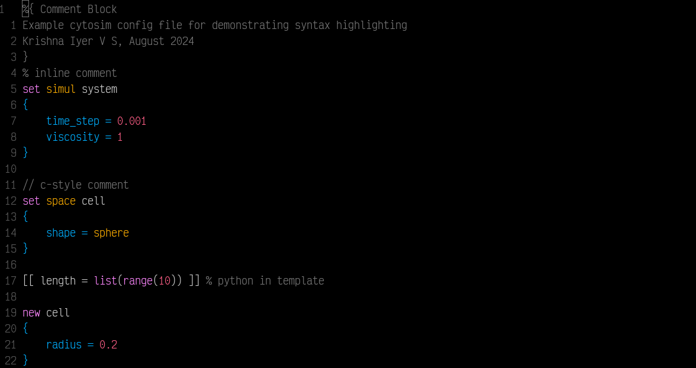

## vim-cytosim

Vim/Neovim syntax highlighting and indentation for cytosim (`*.cym`) and cytosim
preconfig (`*.cym.tpl`) files.

### Installation

- vim-plug

```vim
Plug 'vskrishna1082/vim-cytosim'
```

- vundle

```vim
Plugin 'vskrishna1082/vim-cytosim'
```

- lazy.nvim

```lua
{
	'vskrishna1082/vim-cytosim'
}
```

### Screenshots


